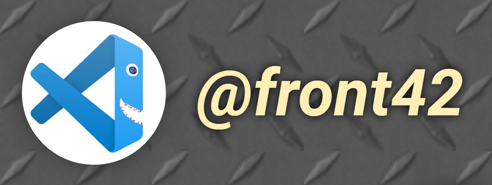

# virtual-piano

For those who want to practice with DOM, JS events and Fullscreen API with something like this [task](https://github.com/irinainina/rss-tasks/blob/master/stage0/js-projects.1/virtual-piano.md) & [hints](https://github.com/irinainina/rss-tasks/blob/master/stage0/js-projects.1/virtual-piano-hints.md).  
Click & enjoy playing your own song on piano keys or keyboard letters:  
***https://front42.github.io/virtual-piano***  

  